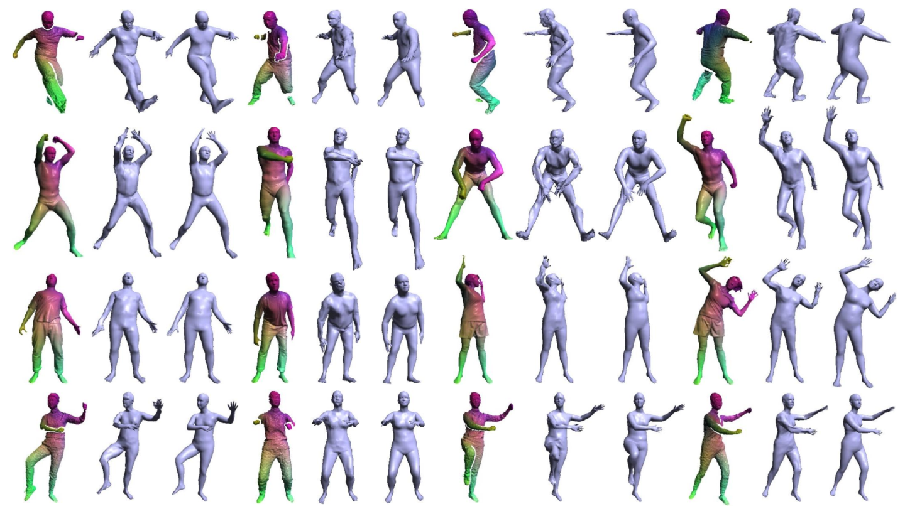
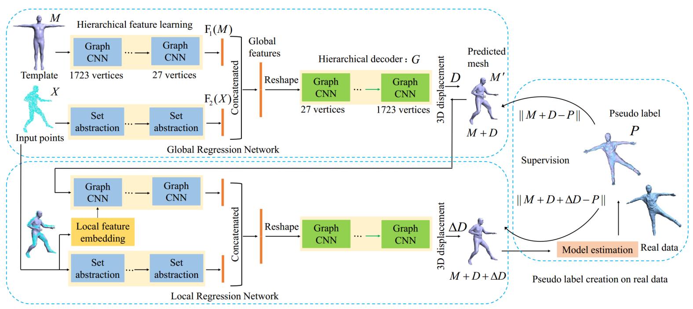

# Learning Dense Correspondences for Non-Rigid Point Clouds With Two-Stage Regression
## [paper](https://ieeexplore.ieee.org/document/9562270)



## Network


## Installation


Please refer 
[`requirements.txt`](requirements.txt)
to prepare the environment.

Then you need compile the code in `*/tf_ops/`. First enter the corresponding folder, i.e. `global_regression/tf_ops/3d_interpolation`


For Stage1 and Stage2, run 
```
make clean && make
```

For Finetune Stage1 and Finetune Stage2, run 
```
./tf_interpolate_compile.sh 
```

### Question 
If you have any questions about compiling `/tf_ops/` when running the code, please first look for solutions from [pointnet2](https://github.com/charlesq34/pointnet2).

## Run the code

Please refer the corresponding `README.md`

[Stage1 and Stage2](stage1/README.md)

[Finetune Stage1 and Finetune Stage2](finetune_stage1/README.md)

## Citation

If you find this code useful for your research, please use the following BibTeX entry.

```
@ARTICLE{Wang_learnging,  
  title={Learning Dense Correspondences for Non-Rigid Point Clouds With Two-Stage Regression},   
  author={Wang, Kangkan and Zhang, Guofeng and Zheng, Huayu and Yang, Jian},    
  journal={IEEE Transactions on Image Processing},   
  year={2021},  
  volume={30},  
  pages={8468-8482},  
  doi={10.1109/TIP.2021.3116786}
}
```


